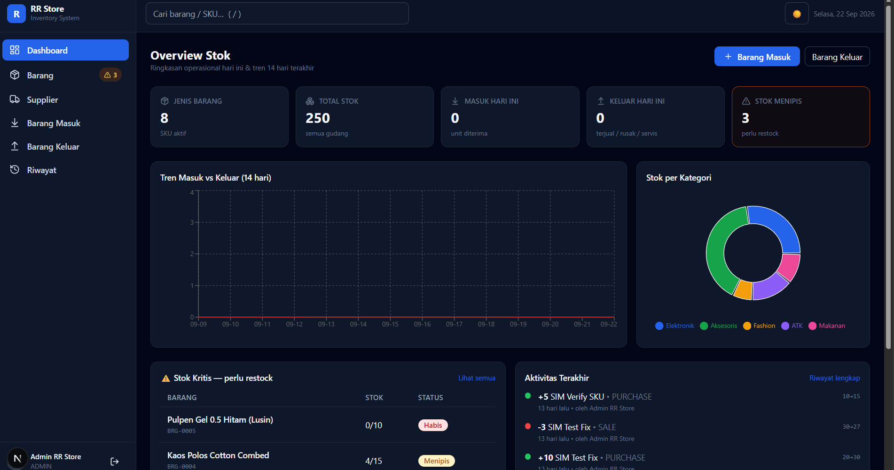
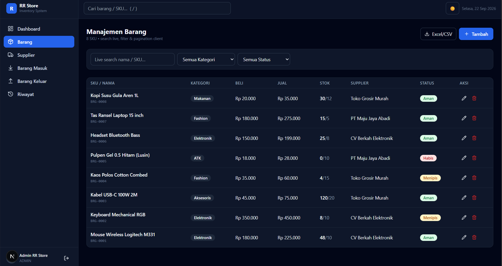
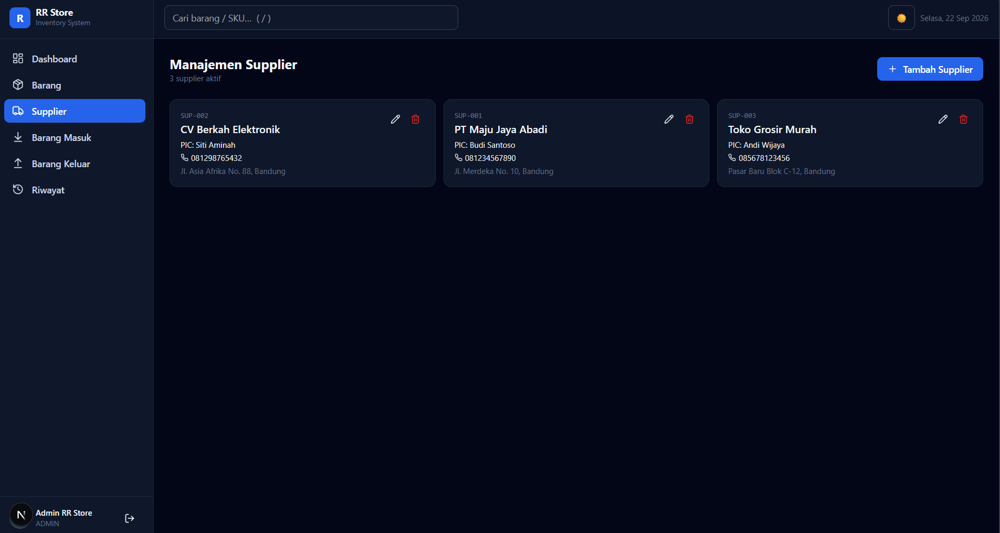

# RR Store Inventory - Next.js Dashboard
Inventory & stock management dashboard built with Next.js 15, Tailwind, Prisma.

Features:
- Dashboard with KPI, charts, low-stock alerts
- Products CRUD with search, filter, CSV export
- Suppliers CRUD
- Stock IN / OUT with validation
- Transaction history (audit log)
- Login with Admin / Staff roles

Tech: Next.js, React, Tailwind, Prisma, SQLite/PostgreSQL

How to run locally:
npm install
npx prisma db push
node prisma/seed.mjs
npm run dev
Open http://localhost:3000

## Screenshots

